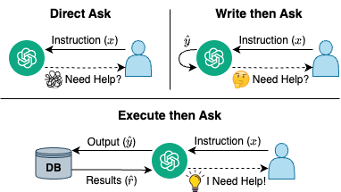

# I Need Help! Evaluating LLM’s Ability to Ask for Users’ Support: A Case Study on Text-to-SQL Generation
**TL;DR:** We propose a framework for LLMs to seek user support, design evaluation metrics to measure the trade-off between performance boost and user burden, and empirically assess this ability on Text-to-SQL generation.

**Paper link:** https://arxiv.org/abs/2407.14767

<p align="center">
  
  <br>
  <em>Figure 1: Overview of our experiments on text-to-SQL. LLMs struggle to determine when they need help based solely on the instruction (x) or their output (y). They require external feedback, such as the execution results (r) from the database, to outperform random baselines.</em>
</p>

## Main Results
| Methods/LLMs         | Wizard  | Llama3  | DPSeek  | GPT-3.5 | Mixtral | GPT-4t  | GPT-4o  |
|----------------------|---------|---------|---------|---------|---------|---------|---------|
| Random Baseline       | 0.5000  | 0.5000  | 0.5000  | 0.5000  | 0.5000  | 0.5000  | 0.5000  |
| Direct Ask            | 0.4915  | 0.4834  | 0.4976  | 0.4390  | <u>0.5301</u>  | <u>0.5758</u>  | <u>0.5479</u>  |
| Write then Ask        | 0.4759  | 0.4497  | 0.4857  | 0.4735  | <u>0.5677</u>  | <u>0.5807</u>  | <u>0.5740</u>  |
| Execute then Ask      | **<u>0.5096</u>**  | **0.4987**  | **<u>0.5848</u>**  | **<u>0.6313</u>**  | **<u>0.6242</u>**  | **<u>0.6641</u>**  | **<u>0.5989</u>**  |

*Table 1: Area Under Delta-Burden Curve (AUDBC) across different methods and LLMs. Text in bold denotes the method with the best performance, while <u>underlined</u> text means better than random (uniform sampling of â ∈ [0, 1]). For the details of AUDBC, please refer to our [paper](https://arxiv.org/abs/2407.14767).*

## How to Run Experiments

### Install Dependencies
```
pip install -r requirements.txt
```

### Download the Text-to-SQL Databases
```
python download_text2sql_data.py
```
The script will download, unzip, and extract Text-to-SQL databases of [BIRD](https://bird-bench.github.io/) to the `./data` directory automatically.

### Run the Main Script
Before running the script, make sure to set your OpenAI API key:
```
export OPENAI_API_KEY=<your-api-key>
```

Suppose you want to test the performance of `gpt-4o-mini-2024-07-18`:
```
python src/run.py \
    --series "openai" \
    --model_name "gpt-4o-mini-2024-07-18" \
    --method "EA"  # ["DA", "WA", "EA"]
```
Abbreviations:
- DA: Direct Ask
- WA: Write then Ask
- EA: Execute then Ask

As the script runs, you can find the results in the `./results/<series>_<model_name>.jsonl` directory.

### Visualize the Results
To visualize the performance curves (Delta-Burden Curve, PR Curve, and Flip Rate Curve) and inspect the performance of each method, run:
```
python src/visualize.py \
    --jsonl "./results/openai_gpt-4o-mini-2024-07-18.jsonl" \  # path to the jsonl file
    --methods "Random EA"  # specify the methods to plot
```
If you want to plot all methods, you can specify `--methods "Random DA WA EA"`.

## Playground
See `playground.ipynb` for step-by-step walkthrough of how to obtain "need-user-support probability" with toy examples.
